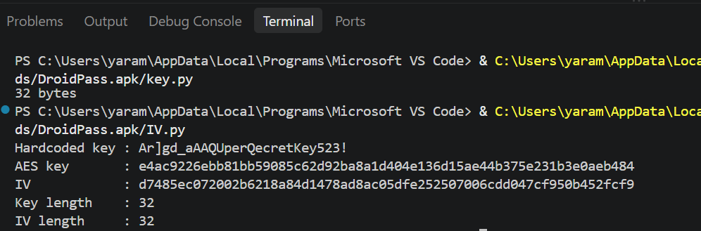
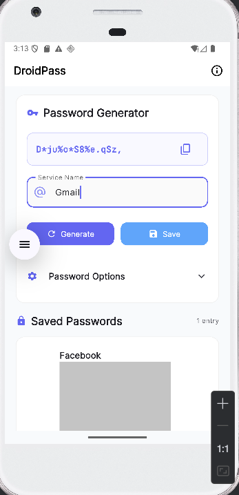
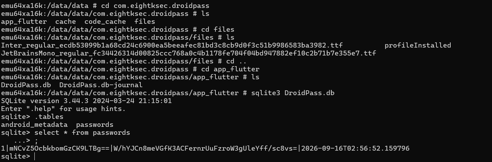
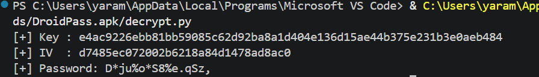

# DroidPass: Ultimate Password Vault

## Challenge Overview

**Application:** DroidPass: Ultimate Password Vault
**Package:** `com.eightksec.droidpass`

The goal of the challenge was to perform static reverse engineering of a Flutter Android application and recover the encryption material used to protect the locally stored password database.

The challenge specifically focused on understanding the Flutter AOT binary and reversing the application's custom encryption logic.

---

# 1. Initial Static Analysis

I started with the APK static analysis and inspected the application structure.

Because this was a Flutter application, the important native Flutter artifact was:

```text
lib/arm64-v8a/libapp.so
```

I loaded `libapp.so` into **Ghidra** and started looking for the application's Dart functions and encryption logic.

However, the result was not very useful.

The Flutter application was compiled using **AOT (Ahead-of-Time) compilation**, meaning the Dart code had already been compiled into native ARM64 code. The binary was also heavily optimized/stripped, so Ghidra was unable to provide a useful high-level decompilation of the relevant Dart classes.

At this point, instead of spending time trying to reconstruct the entire Flutter AOT binary manually, I switched to a Flutter-specific reverse-engineering tool.

---

# 2. Using Blutter

I used **Blutter** to analyze the Flutter AOT snapshot.

The command used was:

```bash
python3 blutter.py ./lib/arm64-v8a blutter_out
```

This produced a collection of reconstructed Dart-related information and pseudo-source representations.

The important result was that I could locate the application's encryption service:

```text
package:droid_pass/services/encryption_service.dart
```

This was much more useful than the original Ghidra output.

---

# 3. Finding the Encryption Service

The relevant class was:

```text
EncryptionService
```

The service contained the encryption/decryption functionality used by the application.

The important flow was essentially:

```text
Encrypted Base64 string
        |
        v
Base64.decode()
        |
        
Encrypted object
        |
        
Encrypter.decrypt()
        |
        
AES.decrypt()
        |
        
Plaintext
```

The application was using the Dart `encrypt` package for the AES implementation.

The generic library code showed the relationship:

```text
Encrypter.decrypt()
        |
        +----> decryptBytes()
                    |
                    +----> AES.decrypt()
```

The important part was that the actual key and IV were created by the application's own `EncryptionService`, rather than being directly passed as obvious plaintext AES parameters.

---

# 4. Reversing the Hardcoded Key

Inside:

```text
package:droid_pass/services/encryption_service.dart
```

the constructor contained the logic responsible for creating the hardcoded key.

Instead of storing the key as a normal string, the application constructed it from character codes.

The AOT representation contained the following values:

```text
130, 228, 186, 206, 200, 190, 194, 130, 130,
162, 170, 224, 202, 228, 162, 202, 198, 228,
202, 232, 150, 202, 242, 106, 100, 102, 66
```

These values looked unusual at first.

However, Dart AOT uses Smi encoding for small integers. In this case, the stored values represented the character codes multiplied by two.

Therefore, I divided every value by `2`.

For example:

```text
130 / 2 = 65  -> A
228 / 2 = 114 -> r
186 / 2 = 93  -> ]
206 / 2 = 103 -> g
```

Applying the same operation to all 27 values produced:

```text
Ar]gd_aAAQUperQecretKey523!
```

So the recovered hardcoded string was:

```text
Ar]gd_aAAQUperQecretKey523!
```

This was the first important secret recovered from the application.

---

# 5. Understanding the Key Construction

The application did not directly use the recovered string as the AES key.

The constructor performed additional transformations.

The relevant logic was approximately:

```text
hardcodedKey
      |
      
UTF-8 encode
      |
      
SHA-256
      |
      
32-byte AES key
```

Therefore:

```text
AES Key =
SHA256(
    UTF8("Ar]gd_aAAQUperQecretKey523!")
)
```

This is important because using the original string directly as the AES key would not reproduce the application's encryption parameters.

---

# 6. Reversing the IV Derivation

The IV was also derived from the same hardcoded value.

The application appended a constant salt:

```text
IV_SALT
```

The derivation was:

```text
hardcodedKey + "IV_SALT"
```

followed by UTF-8 encoding and SHA-256.

Conceptually:

```text
Ar]gd_aAAQUperQecretKey523!IV_SALT
                    |
                    
                  UTF-8
                    |
                    
                  SHA-256
                    |
                    
                    IV
```

So the recovered derivation was:

```text
IV =
SHA256(
    UTF8(
        "Ar]gd_aAAQUperQecretKey523!" + "IV_SALT"
    )
)
```

The exact byte handling used by the final decryption script was kept consistent with the application's `encrypt` implementation.

---

# 7. Key/IV Generation Script

I then reproduced the application's derivation logic in Python.

The important part is:

```python
import hashlib

HARDCODED_KEY = "Ar]gd_aAAQUperQecretKey523!"

key = hashlib.sha256(
    HARDCODED_KEY.encode("utf-8")
).digest()

iv = hashlib.sha256(
    (HARDCODED_KEY + "IV_SALT").encode("utf-8")
).digest()

print("Key:", key.hex())
print("IV :", iv.hex())
```

This allows the encryption material to be generated statically without running the original encryption code.



---

# 8. Bypassing the Security Checks

After recovering the encryption logic, I needed access to the application's local database.

The application contained a `SecurityModule` responsible for several anti-analysis checks.

The class contained three important methods:

```text
a() → application tampering/signature check
b() → root detection
c() → emulator detection
```

The emulator check was particularly relevant because the application was being analyzed inside an Android emulator.

The original `c()` method performed multiple checks.

It first called:

```java
isEmulatorNative()
```

and then checked Android properties such as:

```text
Build.BRAND
Build.DEVICE
Build.FINGERPRINT
Build.HARDWARE
Build.MODEL
Build.MANUFACTURER
Build.PRODUCT
```

It also queried properties such as:

```text
ro.kernel.qemu
ro.hardware
ro.product.device
```

The root check similarly used:

```text
checkRootNative()
```

and additional checks for:

```text
test-keys
su
Magisk
Superuser
ro.debuggable
ro.secure
```

---

# 9. Smali Patch

Instead of trying to satisfy all of those checks individually, I patched the three security methods so that they immediately returned `false`.

The original method bodies were replaced completely.

### Tampering check

```smali
.method public final a()Z
    .locals 1

    const/4 v0, 0x0
    return v0
.end method
```

### Root check

```smali
.method public final b()Z
    .locals 1

    const/4 v0, 0x0
    return v0
.end method
```

### Emulator check

```smali
.method public final c()Z
    .locals 1

    const/4 v0, 0x0
    return v0
.end method
```

The important point was to replace the **entire method body**, rather than simply modifying one of the existing `return` instructions.

This also prevents the original `c()` implementation from reaching:

```java
isEmulatorNative()
```

or executing the Java-side emulator detection logic.

After rebuilding and signing the APK, I installed the patched version on the emulator.



---

# 10. Locating the Password Database

Once the security checks were bypassed, I inspected the application's private data directory.

The database was located at:

```text
/data/data/com.eightksec.droidpass/app_flutter/DroidPass.db
```

I extracted the database from the application environment and opened it using SQLite.

---

# 11. Inspecting the SQLite Database

I opened the database:

```bash
sqlite3 DroidPass.db
```

Then I listed the available tables:

```sql
.tables
```

The relevant table was:

```text
passwords
```

I then queried the table:

```sql
SELECT * FROM passwords;
```

This returned the stored password records.



# 12. Decrypting the Password

used this script to decrypt the password:

```python
import hashlib
import base64

from Crypto.Cipher import AES
from Crypto.Util.Padding import unpad


KEY_MATERIAL = "Ar]gd_aAAQUperQecretKey523!"

# AES-256 key
key = hashlib.sha256(
    KEY_MATERIAL.encode("utf-8")
).digest()

# If the application derives IV this way:
iv = hashlib.sha256(
    (KEY_MATERIAL + "IV_SALT").encode("utf-8")
).digest()[:16]


encrypted = "OjgWhQv9Gbm1Se5O3GG0OkhonSMonNI1ObKNHm8/BmA="

# Choose ONE depending on the ciphertext format:

# Base64:
ciphertext = base64.b64decode(encrypted)

# Hex instead:
# ciphertext = bytes.fromhex(encrypted)


cipher = AES.new(
    key,
    AES.MODE_CBC,
    iv
)

plaintext = unpad(
    cipher.decrypt(ciphertext),
    AES.block_size
)

print("[+] Key :", key.hex())
print("[+] IV  :", iv.hex())
print("[+] Password:", plaintext.decode("utf-8"))
```




# 13. Complete Attack Chain

The complete solution can be summarized as:

```text
APK
 │
 ├── lib/arm64-v8a/libapp.so
 │
 
Ghidra
 │
 └── Flutter AOT code difficult to decompile
 │
 
Blutter
 │
 └── Recover Dart AOT structures
 │
 
encryption_service.dart
 │
 ├── Locate hardcoded character construction
 │
 ├── Extract 27 AOT integer values
 │
 ├── Divide values by 2
 │
 
Ar]gd_aAAQUperQecretKey523!
 │
 ├── SHA-256
 │
 
AES Key
 │
 └── SHA-256(key + "IV_SALT")
 │
 
IV
 │
 
Patch SecurityModule.smali
 │
 ├── a() → false
 ├── b() → false
 └── c() → false
 │
 
Rebuild / Sign / Install APK
 │
 
Extract DroidPass.db
 │
 
sqlite3 DroidPass.db
 │
 ├── .tables
 │
 └── SELECT * FROM passwords;
 │
 
Encrypted password
 │
 
decrypt.py
 │
 
Plaintext password
```

---

# Security Takeaway

This challenge highlights why **proper key management is just as important as choosing a strong encryption algorithm**. Even though the application used AES to protect the password database, embedding the secret in the client made it recoverable through reverse engineering. Once the secret was recovered, the encryption key and IV could be derived and the stored data decrypted offline.

**Strong encryption is only as secure as the way its keys are managed.**

